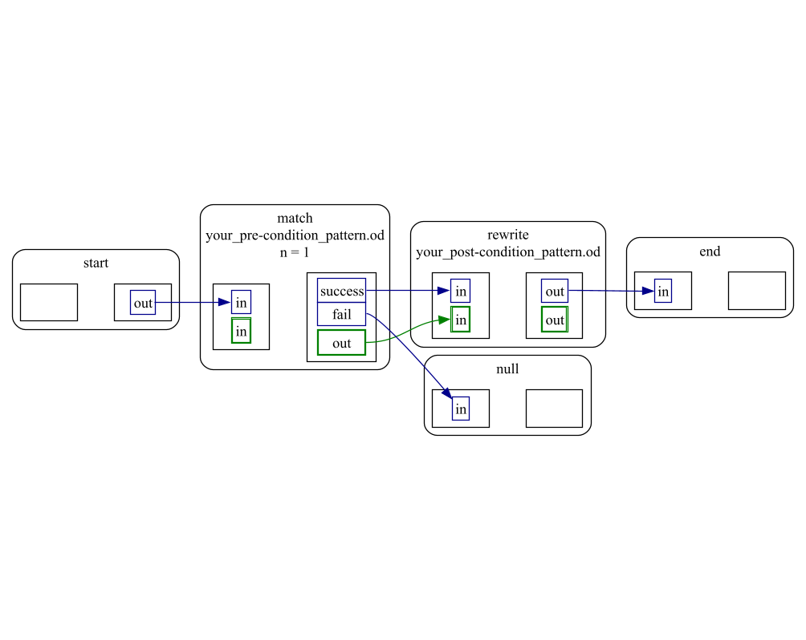
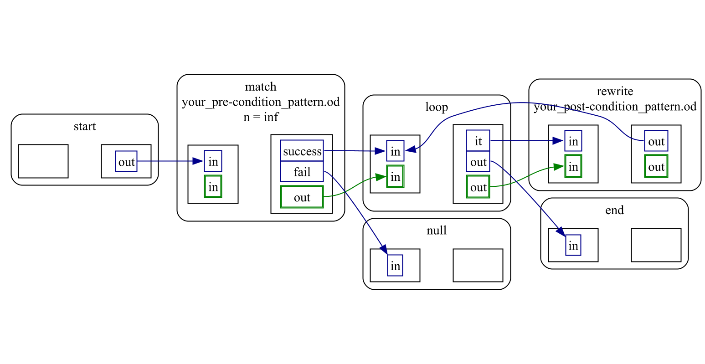
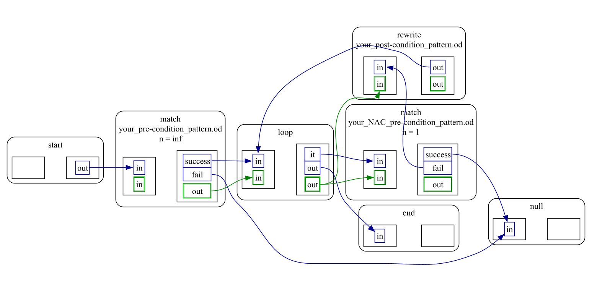
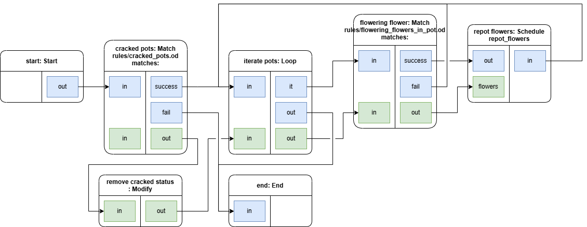
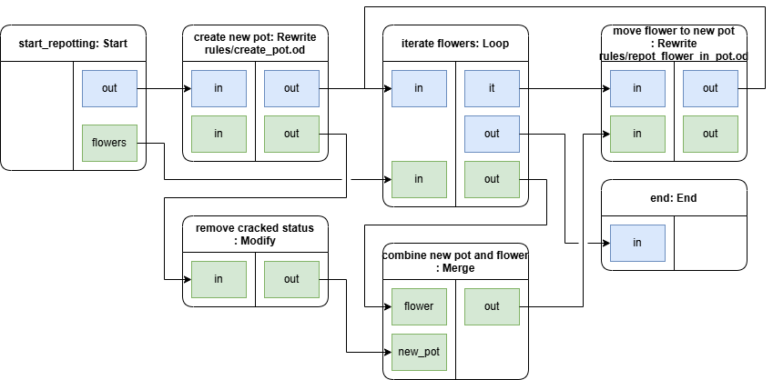

# Schedule Module

This module is used to define and execute model transformations using a schedule in the muMLE framework. 
The development of this module is port of a research project of Robbe Teughels with Joeri Exelmans and Hans Vangheluwe.

## Module Structure

The entire module is wrapped in single interface [schedule.py](../rule_scheduler.py) responsible for loading, executing and other optional functionalities, such as generating dot files.
Loading modules (.py and .drawio) requires compilation. All these transformations are grouped together in [generator.py](../generator.py).
The interactions with the muMLE framework uses the custom interface: [rule_executor.py](../rule_executor.py). This reduces the dependency between the module and the framework.

Schedules are compiled to python files. These files have a fixed interface defined in [schedule.pyi](../schedule.pyi).
This interface includes functionalities that will setup the schedule structure and link patterns or other schedules from the module interface with the nodes.
The compiled files do not include any functional implementation to reduce their size and compile time. They are linked to a libary [schedule_lib](../schedule_lib) including an implementation for each node type.
This means that nodes can be treated as a black box by the schedule. This architecture allowing easier testing of the library as generation is fully independent of the core implementation.

The implementation of a given node is similar in the inheritance compared to the original meta-model to increasing traceability between the original instance and the compiled instance.

## Usage

### Running Module

```python

from state.devstate import DevState
from bootstrap.scd import bootstrap_scd
from util import loader
from transformation.ramify import ramify
from api.od import ODAPI
from transformation.schedule.rule_scheduler import RuleScheduler

state = DevState()
scd_mmm = bootstrap_scd(state)

# load model and meta-model
metamodel_cs = open('your_metamodel.od', 'r', encoding="utf-8").read()
model_cs     = open('your_model.od', 'r', encoding="utf-8").read()

# Parse them
metamodel = loader.parse_and_check(state, metamodel_cs, scd_mmm,   "your_metamodel")
model     = loader.parse_and_check(state, model_cs,     metamodel, "Example model")

# Ramified model
metamodel_ramified = ramify(state, metamodel)

# scheduler
scheduler = RuleScheduler(state, metamodel, metamodel_ramified)

# load schedule
scheduler.load_schedule("your_schedule.od")
# scheduler.load_schedule("your_schedule.py") # compiled version (without conformance checking)
# scheduler.load_schedule("your_schedule.drawio") # main page will be executed

# execute model transformation
api = ODAPI(state, model, metamodel)
scheduler.run(api)
```

#### Simple example schedules (.od format)

A schedule is executed from start to end or NullNode (reachable only from unconnected exec-gates). 
Given the following basic schedule (ARule without NAC), the first match of the pre-condition_pattern is used to rewrite the host graph.
This schedule expect at least one match as the `fail' exec-gate of the match is not connected. 
Zero matches leads to a NullState, resulting in early termination.

```markdown
start:Start
end:End

# match once
m:Match{
    file = "your_pre-condition_pattern.od";
    n = 1;
}

# rewrite
r:Rewrite{
    file = "your_post-condition_pattern.od";
}

:Conn_exec (start -> m) {from="out"; to="in";}
:Conn_exec (m -> r) {from="success"; to="in";}
:Conn_exec (r -> end) {from="out"; to="in";}

:Conn_data (m -> r) {from="out"; to="in";}
```


With some small adjustments, all matches can be rewritten (FRule without NAC)

```markdown
start:Start
end:End

# match all
m:Match{
    file = "your_pre-condition_pattern.od";
    # n = +INF (if missing: all matches)
}

l:Loop

# rewrite
r:Rewrite{
    file = "your_post-condition_pattern.od";
}

:Conn_exec (start -> m) {from="out"; to="in";}
:Conn_exec (m -> l) {from="success"; to="in";}
:Conn_exec (l -> r) {from="it"; to="in";}
:Conn_exec (r -> l) {from="out"; to="in";}
:Conn_exec (l -> end) {from="out"; to="in";}

:Conn_data (m -> l) {from="out"; to="in";}
:Conn_data (l -> r) {from="out"; to="in";}
```


Adding a NAC to this example: adding a match using the previous match and expecting it to fail. (FRule with NAC)

```markdown
start:Start
end:End

# match all
m:Match{
    file = "your_pre-condition_pattern.od";
    # n = +INF (if missing: all matches)
}

l:Loop

# NAC
n:Match{
    file = "your_NAC_pre-condition_pattern.od";
    n = 1; # one fail is enough
}

# rewrite
r:Rewrite{
    file = "your_post-condition_pattern.od";
}

:Conn_exec (start -> m) {from="out"; to="in";}
:Conn_exec (m -> l) {from="success"; to="in";}
:Conn_exec (l -> n) {from="it"; to="in";}
:Conn_exec (n -> r) {from="fail"; to="in";}
:Conn_exec (r -> l) {from="out"; to="in";}
:Conn_exec (l -> end) {from="out"; to="in";}

:Conn_data (m -> l) {from="out"; to="in";}
:Conn_data (l -> n) {from="out"; to="in";}
:Conn_data (l -> r) {from="out"; to="in";}
```


## Node Types

### Start
This node indicates the start of a schedule. 
It signature (additional ports) can be used to insert match sets or alternative exec-paths, increasing reusability.

[Start](schedule_lib/start.md)

### End
Counterpart to Start node. Reaching this node result in successful termination of the schedule.
It signature (additional ports) can be used to extract match sets or alternative exec-paths, increasing reusability.

[End](schedule_lib/end.md)

### Match
Matches a pre-condition pattern on the host-graph. A primitive defined in T-Core

[Match](schedule_lib/match.md)

### Rewrite
Rewrite the host-graph using a post-condition pattern. A primitive defined in T-Core

[Rewrite](schedule_lib/rewrite.md)

### Modify
Modifies the match set. This allows patterns to name elements to their linking. 
This node modifies or deletes elements to be usable as pivot in another pattern with different names.
An example usage can be found in [examples/geraniums](../../../examples/geraniums).

In the following schedule, a cracked filed was matched and no longer needed. 
The Modify node deletes this, allowing for the flowering flower match node to use a pattern without this element, reducing the size and making it more general.
    

[Modify](schedule_lib/modify.md)

### Merge
Combines multiple matches. 
Allowing patterns to be split into different parts or reuse a specific part with another match without recalculating.
An example usage can be found in [examples/geraniums](../../../examples/geraniums).

In the following sub-schedule, a new pot and the flower with old pot and their connection, is combined to move the flower in a rewrite. 
Replanting multiple flowers into one new pot would require markers, making the matching harder in order to combine these elements without the use of this node.



[Merge](schedule_lib/merge.md)

### Store
Combines matches (set) into a new match set. 
Use the exec port to insert the data on the associated data-port to the set.

The direct usage of this node is limited but invaluable for libraries. 
An example usage is petrinet-execution with user interface. 
This requires a list of all transitions that can fire. 
Matching "all transitions" followed by a loop to check the NAC leaves single matches.
This nodes allows these matches to be recombined into a set that can be used to choose a transition from.

[Store](schedule_lib/store.md)

### Loop
Iterate over a given match set. 
Nodes such as Match or Rewrite uses a single match as a pivot. 
Executing these nodes over all the element is possible with this node.
See the examples in [Modify](#Modify) or [Merge](#Merge) for an example view. 

[Loop](schedule_lib/loop.md)

### Print
Print the input data. This is mainly used as a debugging/testing tool to validate intermediate information or state.

[Print](schedule_lib/print.md)

### Action
This node allows for code to be injected into the schedule.
This node can be used for general purpuse and even recreate all other nodes (except start and end).
Not all functionalities can be described using the current nodes. For petrinets, an example can be to generate a visual overview of the petrinet-system.

[Action.md](schedule_lib/action.md)

## file formats

### .od
This is the original textual file format used by the framework. The main advantage of this format is the integration with the framework that allows conformance checking of the scheduling language. 
Therefore, all other formats are converted to this type for conformance checking before being compiled.

### .py
All schedules are compiled to python after conformance checking. Allowing this format provides the benefit to load schedules without expensive compilation or conformance checking, reducing computational cost.
This format is recommended in the deployment of applications where the schedule will not change. 
It is not advisable to implement schedules directly in this format as conformance checking guarantees proper working of the schedule module.

### .drawio
A visual format for the drawio application. 
The library includes a drawio [library](../schedule_lib/Schedule_lib.xml) that includes a representation with additional fields for easy integration with the application.
The main advantage of this format is the usage of pages that allows sub-schedules be easily created and organised within one schedule. (layers are not allowed)

